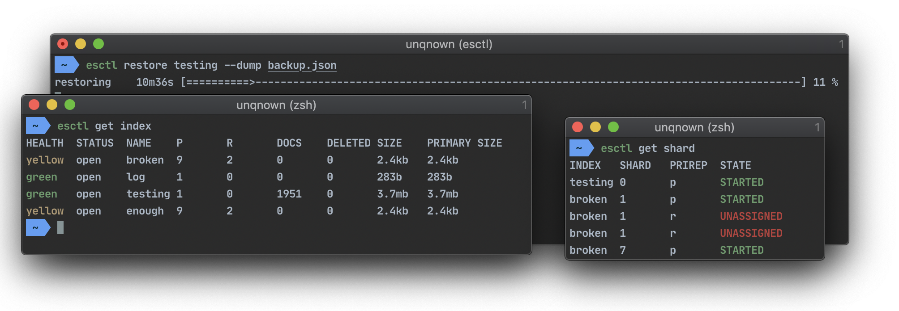

### esctl

esctl is cli tool for Elasticsearch cluster managing.



### features

- expressive and intuitive syntax
- formatted and colorized terminal output
- components high-level information
- indices management
- content dumping/restoring

### installation

Standard `go install`:

```shell script
go install github.com/unqnown/esctl
```

### quick start

`esctl` requires configuration file to connect to a cluster.
However, it is a waste of time to create configuration file from scratch.
Therefore it's recommended to use the `init` command which will create it interactively.

To start using `esctl` immediately with default configuration run:

```shell script
esctl init
```

Default configuration will be added to your `$HOME/.esctl` directory.
You are able to override config location with `$ESCTLCONFIG` env variable.

```yaml
version: v0.1.0
workdir: ~/.esctl/
clusters:
  localhost:
    servers:
    - http://localhost:9200
contexts:
  default:
    cluster: localhost
    location: default
context: default
```